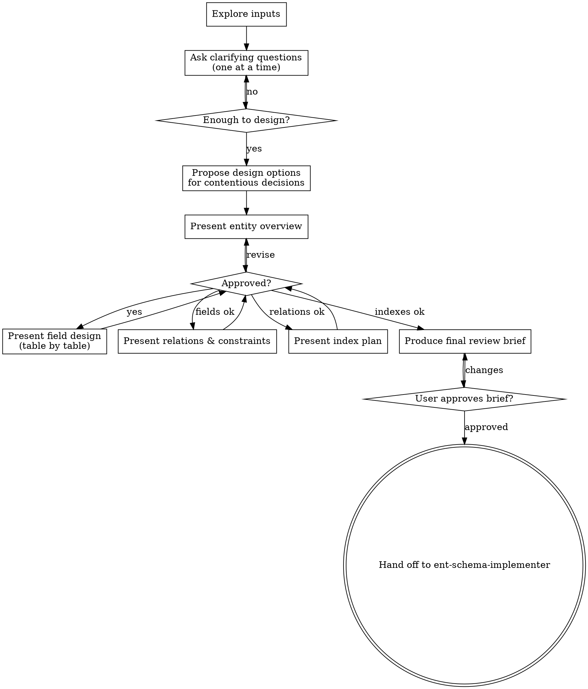

# DB Schema Designer

Turn product and backend requirements into a review-ready database design — collaboratively, through dialogue.

This skill works through clarifying questions and incremental design sections rather than generating a complete document in one pass. The goal is a design the user has actively approved, not a document they need to diff against their intent.

<HARD-GATE>
Do NOT produce the final review brief, write Ent schema code, or hand off to `ent-schema-implementer` until every design section has been presented AND the user has approved the overall design. If requirements are ambiguous, stop and ask rather than assume.
</HARD-GATE>

## Scope Boundary

**Do:**
1. Ask clarifying questions one at a time to resolve ambiguities.
2. Propose 2-3 design options for non-obvious decisions (deletion strategy, ID type, relation shape, etc.).
3. Present the design incrementally — entities → fields → relations → indexes — pausing for feedback at each section.
4. Surface assumptions, trade-offs, and open questions explicitly.
5. Produce the final review brief once the user approves the full design.

**Do not:**
1. Write Ent schema code unless the user explicitly asks for the follow-up implementation step.
2. Add entproto numbering, Go integration instructions, or bind/render/service tasks.
3. Silently pick a contentious default (soft delete, UUID, complex JSON) — surface it as a choice.

If the design is approved and code should be written, hand off to `ent-schema-implementer`.

## Required Reading

Read these files before producing any design output:

1. [references/modeling-rules.md](references/modeling-rules.md) — field type policy, relation strategy, index rules
2. [references/review-output-template.md](references/review-output-template.md) — final output structure

## Checklist

Work through these in order. Use TodoWrite to create a task for each item.

1. **Explore inputs** — read provided docs, proto files, mockups, existing schemas, service behavior
2. **Ask clarifying questions** — one at a time, until entities and key behaviors are clear
3. **Propose design options** — for any non-trivial decision, offer 2-3 choices with trade-offs
4. **Present entity overview** — list candidate entities with purpose and lifecycle; get approval
5. **Present field design** — table by table, with types, nullability, defaults; get approval
6. **Present relations and constraints** — one-to-many, many-to-many, deletion, uniqueness; get approval
7. **Present index plan** — tied to real query patterns; get approval
8. **Produce final review brief** — using [references/review-output-template.md](references/review-output-template.md)
9. **Write review brief to disk** — default path: `prd/DDL.md`; use `design/<feature>/schema.md` if the request is scoped to a named feature or change-id
10. **User approves review brief** — ask explicitly before handing off to `ent-schema-implementer`

## Process Flow

## Phase 1: Explore and Clarify

Before asking anything, check what is already available: prompt text, referenced docs, proto files, existing Ent schemas, API contracts, or mockups. Extract what you can without asking.

Then ask clarifying questions **one at a time**:

- Prefer multiple-choice questions when there are clear alternatives.
- Only one question per message — if you need more, come back after the answer.
- Focus on: missing entity boundaries, lifecycle states, business invariants, query patterns, and deletion semantics.
- Stop asking once you can make a reasonable design proposal.

**Good question:** "Should deleted records be recoverable, or is deletion permanent? A) Soft-delete (`deleted_at` field, recoverable) B) Hard-delete (row removed) C) Archive to a separate table"

**Bad question:** "Can you tell me more about your requirements?"

## Phase 2: Design Options

For non-trivial decisions, present 2-3 options with trade-offs and your recommendation before proceeding. This is especially important for:

- ID strategy (int64 auto-increment vs. external ID vs. compound key)
- Deletion strategy (hard / soft / archive)
- Many-to-many shape (join table vs. relation entity with attributes)
- Complex field representation (JSON blob vs. explicit columns vs. relation entity)
- Money or decimal fields

Lead with your recommended option and explain why. The user picks; you proceed.

## Phase 3: Incremental Design Presentation

Present the design in sections. After each section, ask whether it looks right before moving on.

**Entity overview first** — a simple table: entity name, purpose, key lifecycle states. No fields yet. Example:

> "Here are the candidate entities. Does this set look right before we go into fields?"

**Field design section by section** — one entity at a time. Apply [references/modeling-rules.md](references/modeling-rules.md) to every field:

- Check each field against the allowed type shapes.
- If a requested type doesn't fit (datetime object, UUID primary key, JSON blob, float money), redesign it here and explain the substitution.
- Note mutable vs. immutable fields explicitly.

**Relations and constraints** — cover one-to-many foreign keys, many-to-many shapes, uniqueness constraints, referential integrity, and deletion cascade rules.

**Index plan** — every index must be tied to a real, named query pattern (e.g., "list orders by user, paginated by created_at"). Never propose an index without a reason.

## Phase 4: Final Review Brief

Once all sections are approved, produce the review brief using [references/review-output-template.md](references/review-output-template.md) exactly:

1. Keep section order unchanged.
2. Write `N/A` for non-applicable sections.
3. Include the field-type compatibility section with every type decision explained.
4. Separate confirmed decisions from open questions clearly.
5. Keep the document review-oriented, not code-oriented.

After producing the brief, write it to disk:
- Default: `prd/DDL.md`
- Feature-scoped: `design/<feature>/schema.md` (use when the user names a specific module or change-id)

Then ask the user to review it:

> "Design brief written to `<path>`. Please look it over — if anything needs adjusting, let me know and I'll update it. Once you're happy, I can hand off to `ent-schema-implementer` to start writing the Ent schemas."

Wait for explicit approval before handing off.

## Key Principles

- **One question at a time** — don't stack questions; wait for the answer
- **Multiple choice preferred** — easier to respond to than open-ended
- **Surface choices, don't bury them** — contentious defaults must be presented as options
- **Explain type redesigns** — when a requested type is replaced, say why clearly
- **Every index needs a query** — no speculative indexes
- **Approved design before final document** — the brief captures decisions already made together, not decisions being revealed for the first time
