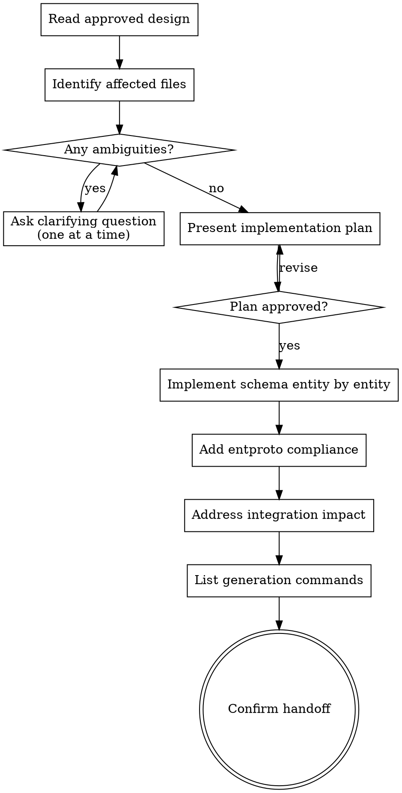

# Ent Schema Implementer

Convert an approved database design into concrete Ent schema changes for go-sphere projects — step by step, with explicit checkpoints before writing code.

This skill starts after the data model is stable enough to code. Its focus is Ent schema files, entproto compliance, generation impact, and downstream integration checkpoints. It confirms the implementation plan first, then implements, rather than writing code immediately and hoping the assumptions were right.

<HARD-GATE>
Do NOT write any Ent schema code, modify any file, or run any generation command until you have presented an implementation plan and the user has confirmed it. If requirements are still fluid or ambiguous, stop and return to `db-schema-designer`.
</HARD-GATE>

## Entry Gate

Use this skill only when at least one of these is true:

1. The user explicitly says the database design is approved.
2. There is an accepted review brief or spec that defines the entities.
3. The task is clearly to implement or update Ent schema code rather than debate data modeling.

If requirements are still fluid, stop and return to `db-schema-designer`.

## Required Reading

Read these files before starting any implementation work:

1. [references/implementation-rules.md](references/implementation-rules.md)
2. [references/ent-schema-examples.md](references/ent-schema-examples.md)

Read this when integration work is in scope:

3. [references/go-ent-service-patterns.md](references/go-ent-service-patterns.md)

## Checklist

Work through these in order. Create a task for each item.

1. **Read approved design** — extract confirmed entities, fields, relations, indexes
2. **Identify affected files** — existing schema files to modify, new ones to create
3. **Ask clarifying questions** — one at a time, for any ambiguity that would change code shape
4. **Present implementation plan** — entity-by-field mapping, entproto annotations, index plan; get approval
5. **Implement schema files** — entity by entity, following implementation-rules.md
6. **Add entproto compliance** — Message(), Field(n), Enum() annotations
7. **Address integration impact** — bind registration, ignored fields, render, service touchpoints
8. **List generation commands** — ordered list of commands the user must run
9. **Confirm handoff** — summarize what was done, flag follow-up work

## Process Flow



## Phase 1: Read and Clarify

Read the approved design or spec. Extract:
- Confirmed entities and their purposes
- Field list with types, nullability, defaults, and mutability
- Relation shapes (one-to-many, many-to-many)
- Index plan tied to query patterns
- Any open questions still marked in the design

If anything is missing or ambiguous in a way that would affect the code shape, ask **one question at a time** before proceeding. Don't guess at field types, enum values, or relation ownership — those choices are hard to change after generation.

Good question to ask: "The design mentions an `order_items` relationship but doesn't specify whether `OrderItem` should be its own entity with attributes or a simple join. Which do you need?"

Do not ask questions about things already clearly specified in the design.

## Phase 2: Implementation Plan

Before writing any code, present a structured plan. This surfaces mismatches between the design doc and the actual file layout before they become coding mistakes.

Include:

- **Affected files** — list each schema file with whether it's new or modified
- **Entity mapping summary** — one row per entity: entity name → field count, relation count, index count
- **Entproto field numbering strategy** — confirm field order for ID=1 assignment (especially important for modified schemas where existing numbers must not shift)
- **Integration scope** — which bind, render, or service files will need manual follow-up
- **Assumptions** — any design gap you filled with a default choice

Ask explicitly: "Does this plan look right before I start writing?"

The plan can be brief for small schemas (one entity, a few fields). Scale it to the complexity of the work.

## Phase 3: Implement Schema Files

Work through entities one at a time, following [references/implementation-rules.md](references/implementation-rules.md) and [references/ent-schema-examples.md](references/ent-schema-examples.md).

For each entity:
1. Write the schema struct, Fields(), Edges(), and Indexes().
2. Apply field policies: required, optional, default, unique, immutable.
3. Implement relations using project conventions.
4. Add indexes tied to approved query patterns only — no speculative indexes.

Never invent unapproved entities or fields. If you notice something missing that seems clearly needed (e.g., a standard `created_at` timestamp), label it as `// Assumption: added standard audit timestamp` in a comment.

## Phase 4: EntProto Compliance

Add entproto annotations to every schema:

- `entproto.Message()` on every schema struct.
- Sequential `entproto.Field(n)` on every field, starting with ID at `1`.
- `entproto.Enum(...)` mappings for enum fields with values starting from `1` (not `0` — proto3 default value convention).
- For modified schemas: preserve existing field numbers exactly. Shifting numbers breaks proto compatibility.

If a field number conflict exists (e.g., extending a schema where some numbers are already taken), flag it before writing rather than picking a number silently.

## Phase 5: Integration and Verification

After the schema files are done:

1. **Bind registration** — note which entities need to be registered and where.
2. **Ignored fields** — flag any fields that should be excluded from proto generation.
3. **Render impacts** — identify any render layer files that reference the changed schema.
4. **Service touchpoints** — list any service files that will need updates after generation.

For each item, specify whether it is: (a) handled by generation, (b) requires manual follow-up, or (c) requires a separate skill invocation.

Then list the required generation and verification commands in the order they must be run:

```
# Example order — adapt to actual project setup
go generate ./ent/...
buf generate
go build ./...
```

## Handoff Message

Close with a structured summary:

> **Done.** Implemented `N` entities across `M` files.
>
> **Run these commands:**
> 1. `...`
> 2. `...`
>
> **Manual follow-up needed:**
> - `...`
>
> **Next skill:** If you need service implementations from the generated interfaces, use `proto-service-generator`.

This makes it easy to hand the work off without the user having to reconstruct what happened.
