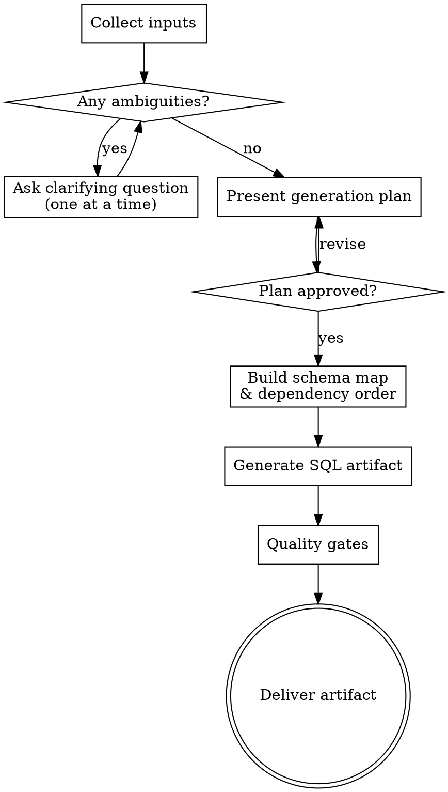

# Ent Seed SQL Generator

Produce one executable seed SQL artifact from Ent schemas and mixed evidence — with deterministic IDs, valid relationships, and realistic production-like data. Confirm the generation plan before writing SQL so that dialect, strategy, and scope mismatches are caught before they waste effort.

<HARD-GATE>
Do NOT write any SQL until you have confirmed the dialect, strategy, entity scope, and approximate row counts with the user (or resolved them from evidence). A wrong dialect assumption invalidates every line; a wrong strategy choice creates rework.
</HARD-GATE>

## Trigger / Non-Trigger

Use this skill when the task is to generate or revise seed SQL from Ent schema context, docs, demo behavior, or prompt requirements.

Do not use this skill for schema migration design, runtime repository/service implementation, or query performance tuning.

## Reference Loading Plan

Load only what is needed for the current task:

- [references/model-extraction.md](references/model-extraction.md): entity/field/relation extraction and dependency planning
- [references/id-and-relation-rules.md](references/id-and-relation-rules.md): deterministic IDs, FK integrity, multi-tenant constraints
- [references/output-sql-pattern.md](references/output-sql-pattern.md): final SQL layout and strategy-specific patterns
- [references/password-hashing.md](references/password-hashing.md): only when credential fields are seeded

## Checklist

Work through these in order. Create a task for each item.

1. **Collect inputs** — prompt, Ent schema files, existing seeds, product docs
2. **Detect dialect and resolve ambiguities** — ask one question at a time if unclear
3. **Present generation plan** — entities, strategy, row counts; get approval
4. **Build schema map** — dependency order, FK graph, enum values
5. **Generate SQL artifact** — following output-sql-pattern.md
6. **Run quality gates** — orphan FKs, unique violations, missing required fields

## Process Flow

## Phase 1: Collect Inputs and Clarify

Gather available inputs in this order:

1. Current prompt requirements
2. Ent schemas and migration/DDL files (`ent/schema/*.go`, `ent/migrate/`)
3. Existing seed files and demo code behavior
4. Product docs and domain notes

Then detect the SQL dialect:
- Check `ent/client.go` or config for driver name (`mysql`, `postgres`, `sqlite`)
- Look at migration files for dialect-specific syntax
- Check `go.mod` for dialect imports (`ent/dialect/mysql`, etc.)

If any of the following are unclear after reading available inputs, ask **one question at a time**:

- **Dialect**: "I couldn't determine the database dialect from the project files. Which are you targeting — MySQL, PostgreSQL, or SQLite?"
- **Strategy**: "Should this seed be one-shot (fresh setup only), idempotent (`INSERT OR IGNORE` / `ON CONFLICT DO NOTHING`), or upsert (`ON CONFLICT DO UPDATE`)?"
- **Scope**: "Should I seed all entities, or a specific subset? If a subset, which ones?"
- **Row counts**: "How many rows per entity? (3-10 is typical for development seeds)"

Do not ask questions that can be answered from the available files. Ask only what genuinely changes the output.

## Phase 2: Generation Plan

Before writing SQL, present a compact plan:

> **Dialect:** MySQL
> **Strategy:** idempotent
> **Entity order** (by dependency):
> 1. `organizations` — 3 rows, no dependencies
> 2. `users` — 5 rows, FK → organizations
> 3. `projects` — 4 rows, FK → organizations + users
>
> **ID ranges:** organizations 2000–2999, users 1000–1999, projects 3000–3999
> **Assumptions:** password fields will use a fixed bcrypt hash for test credentials
>
> Does this look right before I start writing?

Scale the plan to the complexity of the task. For a single entity with no FKs, a one-line summary is enough. For multi-tenant systems with many tables, list the full dependency order.

## Phase 3: Build Schema Map

After plan approval, read [references/model-extraction.md](references/model-extraction.md) and extract from `ent/schema/*.go`:

- **Fields**: type, `Optional`, `Nillable`, `Unique`, `Default`, `Immutable`, `Sensitive`
- **Enums**: all valid values from `field.Enum` or `validate` rules
- **Edges**: `edge.To`, `edge.From`, `Required`, `Unique`, `Ref` — derive FK ownership
- **Indexes**: unique constraints and composite indexes

Compute topological dependency order: tables with no FK references first, dependent tables after. Join tables last.

## Phase 4: Generate SQL Artifact

Follow [references/output-sql-pattern.md](references/output-sql-pattern.md). Apply [references/id-and-relation-rules.md](references/id-and-relation-rules.md) for ID ranges and FK integrity.

**ID Assignment:**
- Integer PKs: use non-overlapping ranges per entity type
- String PKs: use semantic IDs (`usr_admin`, `org_acme`)
- UUIDs: deterministic from business keys, never random

**Data Coherence:**
- Timestamps: `created_at <= updated_at`, spread across realistic ranges
- Status progressions: realistic lifecycle (`draft → active → archived`)
- Ownership: every `owner_id` references an existing user row
- Text content: meaningful strings, not Lorem Ipsum; real email patterns

For credential fields, read [references/password-hashing.md](references/password-hashing.md).

**Dialect-specific patterns:**

| Type | PostgreSQL | MySQL | SQLite |
|------|-----------|-------|--------|
| JSON | `'{"k":"v"}'::jsonb` | `'{"k":"v"}'` | `'{"k":"v"}'` |
| Array | `ARRAY['a','b']` | not native | not native |
| Bool | `TRUE`/`FALSE` | `1`/`0` | `1`/`0` |
| Timestamp | `'2026-01-01 09:00:00'` | `'2026-01-01 09:00:00'` | `'2026-01-01 09:00:00'` |

**Special cases to handle inline:**
- Soft deletes: set `deleted_at` to `NULL` for active records
- Self-referential (trees): insert root first, children reference valid parent IDs
- Multi-tenant: seed tenant table first; all dependent tables must carry valid tenant FK
- Composite unique constraints: verify all column combinations are unique across rows

## Phase 5: Quality Gates

Before delivering, verify:
- [ ] No orphan FKs — every referenced ID exists
- [ ] No unique constraint violations — including composite unique indexes
- [ ] No placeholder or TODO values
- [ ] All IDs are deterministic (no random or auto-generated values)
- [ ] Timestamps are internally consistent (`created_at <= updated_at`)
- [ ] All required fields (`Required()` in Ent schema) are present in every INSERT
- [ ] No invalid enum values
- [ ] JSON columns contain valid JSON strings

## Output Contract

Deliver exactly one SQL artifact (inline or file, per user request) with:

1. Header comments: source inputs, dialect, strategy, assumptions
2. Optional cleanup block (only for idempotent/upsert strategies)
3. `INSERT` blocks grouped by dependency order, each group preceded by a comment
4. Optional verification `SELECT` queries (only when requested)

## Guardrails

- Never invent tables or columns without evidence — mark inferences as comments
- Never use random IDs — seed IDs must be stable across runs
- Never break FK dependency order — parents before children, join tables last
- Never bloat row counts — 3–10 rows per core table is usually sufficient
- Never expose production credentials — use test-only values
- Never mix dialects in one file
- Never omit required fields
