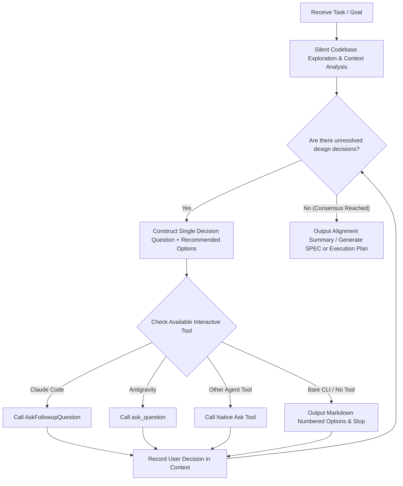

# Interview Me (Interactive Requirements & Design Alignment)

Thoroughly interview the user about every aspect of their task until reaching a complete, shared technical and product understanding. Walk down each branch of the design tree, resolving dependencies between decisions one-by-one.

---

## Core Principles

1. **Codebase First (Silent Exploration)**:
   - Before asking any question, actively explore existing code, schema definitions, protobuf contracts, config files, and documentation.
   - **Never ask the user questions that can be answered by reading the codebase.**
2. **One Question at a Time**:
   - Never overwhelm the user with long lists of questions.
   - Focus exclusively on the single most critical blocking decision point in each turn.
3. **Bring Recommendations**:
   - For every question, always provide a clear recommended option (marked with `(Recommended)`) and explain the trade-offs concisely.
4. **Native Interactive Tool First**:
   - Prefer calling the runtime's native interactive prompt/selection tool (`AskFollowupQuestion` in Claude Code, `ask_question` in Antigravity, etc.).
   - Fall back to clean Markdown numbered choices only when running in a bare CLI environment without interactive tool capabilities.
5. **Top-Down Decision Tree**:
   - Resolve decisions in order: System Boundaries -> Architecture & Data Flow -> Storage & Schema -> API Contracts -> Edge Cases.

---

## Multi-Platform Tool Mapping

| Platform / Runtime | Native Tool / Mechanism | Invocation Specification |
| :--- | :--- | :--- |
| **Claude Code** | `AskFollowupQuestion` | Pass `question` and `options` array. Place the recommended option first with `(Recommended)`. |
| **Antigravity / Gemini** | `ask_question` | Pass `questions` array containing `question`, `options`, and `is_multi_select`. |
| **OpenAI / Codex / Cursor** | Native user prompt tool (or Markdown fallback) | Dynamically detect and invoke available user-prompt tools (e.g., `ask_user`, `request_user_input`). If none exist, output numbered Markdown options and stop generating to wait for input. |

---

## Workflow



### Step 1: Silent Codebase Exploration
- Read existing implementations, models, schemas, and endpoints related to the user's prompt.
- Identify established constraints, reusable components, and architectural conventions.

### Step 2: Build the Decision Tree
Structure pending decisions along the following hierarchy:
1. **Scope & Boundaries**: Goals, core user roles, inputs, and expected deliverables.
2. **Architecture & Service Responsibility**: Frontend vs. backend boundaries, service ownership, protocols.
3. **Data Model & Lifecycle**: Entities, schemas, field types, persistence, TTL, and deletion policies.
4. **API Contracts & UX Interactions**: Endpoint payloads, error states, and UI feedback flows.
5. **Edge Cases & Resilience**: Failure recovery, concurrency, migration compatibility, and rate limits.

### Step 3: Step-by-Step Questioning
- Pick the single most blocking decision at the current hierarchy level.
- Format the prompt:
  - Summarize the decision context in 1-2 sentences.
  - Provide 2–4 mutually exclusive or select choices.
  - Highlight the recommended approach with `(Recommended)`.

**Example (Text Fallback Mode when no tool is available)**:
```markdown
### Decision Point: Task Context Synchronization

We need to decide how task changes in the editor synchronize with the backend:

1. **(Recommended) On-demand Lazy Snapshots**: Only fetch/persist task state on entering task views, minimizing unnecessary synchronization overhead.
2. **Real-time Global Sync**: Broadcast every asset/slot state modification to all connected clients immediately.

Please reply with your preferred option number (e.g., `1`) or share your thoughts:
```

### Step 4: Consensus & Delivery
Once all critical branches of the decision tree have converged:
- Summarize confirmed architectural decisions clearly.
- Produce the final deliverable (e.g., update `SPEC.md`, write a PRD, or create a concrete phased implementation plan).

---

## Questioning Guidelines

- **User-Centric Phrasing**: Phrase selectable options from the user's perspective (e.g., "Adopt Option A: Keep computations in the frontend").
- **No Redundant Placeholders**: Do not include redundant generic "Other" options (UI or fallback text naturally allows freeform input).
- **Exact File References**: Use clickable markdown links when referencing files (e.g., `[AppProviders.tsx](file:///path/to/file#L10)`).
